# Registro da entrega em produção — 26/08/2026

Status: **produção validada ponta a ponta**.

Este documento registra o que foi construído, o que falhou, como cada falha foi provada e quais
barreiras ficaram no sistema. Ele não contém tokens, URLs privadas nem respostas cruas da
planilha.

## Resultado entregue

- Site público: <https://jorgeyuridj.github.io/movimenta7/>
- Cadastro sem login por Google Form, integrado visualmente ao site.
- Respostas mantidas em planilha privada; nenhuma aba precisa de “Publicar na web”.
- Publicação automática normalmente em cerca de 1–2 minutos.
- Mapa Leaflet, lista acessível, busca e filtros por modalidade/região.
- Rede social institucional e rota do Google Maps em cada atividade.
- Posição explicitamente `exata` ou `regiao`; aproximação nunca finge precisão.
- Retirada reversível pela coluna `remover`.
- Última versão válida permanece no ar quando origem, contrato, testes ou gates falham.

Evidências da entrega:

- PR principal: [#1 — entrega mapa automático seguro](https://github.com/JorgeYuriDj/movimenta7/pull/1), merge `29ad63b`.
- PR do incidente visual: [#2 — corrige carregamento do mapa](https://github.com/JorgeYuriDj/movimenta7/pull/2), merge `3ff4d2b`.
- Suíte final: **137/137 testes**, contraste e gate anti-HTML cru aprovados.
- QA e CodeQL aprovados antes das duas mesclas.
- Envio real do Form disparou `workflow_dispatch`; o snapshot passou de 1 para 2 registros.
- Chrome limpo em produção confirmou `leaflet-container`, mapa no estado `pronto`, dois grupos e
  o cadastro de teste visível, sem botão de erro.

## Arquitetura final

```mermaid
flowchart LR
  P[Pessoa] --> F[Google Form público]
  F --> S[Planilha privada]
  S --> A[Apps Script]
  A -->|workflow_dispatch| G[GitHub Actions]
  G -->|POST + token| W[Web App / feed privado]
  W --> I[Ingestão e quarentena por registro]
  I --> V[Gates do snapshot]
  V -->|somente se verde| J[JSON público sanitizado]
  J --> H[GitHub Pages: mapa + lista]
```

Fronteiras importantes:

1. Formulário e planilha são a origem privada; texto cru não entra no Git.
2. O Web App aceita leitura das células somente em `POST` autenticado; `GET` é health check sem
   dado da planilha.
3. O job `qa` não recebe segredos. Somente `publish`, no ambiente `github-pages` e em `main`, lê o
   feed.
4. `CAMPOS_PUBLICOS` é a allowlist de saída. Dado não declarado não atravessa o pipeline.
5. O navegador recebe apenas `data/snapshot.json`, já normalizado e validado.

## Operação cotidiana

### Adicionar

A pessoa preenche o Form e escolhe **Cadastrar uma atividade nova**. Cadastro válido entra sem
aprovação manual. O proprietário não precisa copiar dados nem executar script.

### Retirar do mapa

1. Abra a planilha privada de respostas.
2. Ache a linha pelo valor da coluna **Nome do grupo**.
3. Vá até a última coluna, **`remover`**.
4. Marque a caixa dessa linha.
5. Não exclua a linha. A edição dispara a Action e a atividade sai normalmente em 1–2 minutos.

A retirada é reversível: desmarcar `remover` pede nova publicação e restaura o cadastro se ele
continuar válido. Isso é o freio de emergência e também preserva a trilha operacional.

### Corrigir

Não edite JSON no repositório. O procedimento seguro é:

1. marcar `remover` na linha antiga;
2. enviar um novo cadastro com as informações corretas;
3. confirmar mapa, rota e rede social;
4. manter a linha antiga marcada como histórico privado.

O ramo **Corrigir ou REMOVER um cadastro** do formulário é privado e serve para receber o pedido.
Ele não altera o mapa sozinho porque um texto livre não deve conseguir remover conteúdo sem a
decisão do proprietário. O alerta enviado pelo Apps Script contém apenas o link da planilha, não
o texto do pedido.

### Exclusão definitiva da resposta privada

Para sair do mapa, use `remover`; não é necessário apagar a resposta. Exclusão definitiva da
planilha é excepcional (por exemplo, solicitação legítima do titular) e deve ser decidida pelo
proprietário depois de confirmar a linha exata. Nunca reescreva o histórico Git para isso: as
respostas cruas não devem estar nele.

## Controles de segurança que ficaram ativos

- O Form não solicita nome pessoal, telefone, e-mail, documento, CREF ou dado de menor.
- Rede social e mapa são obrigatórios; hosts, caminhos e formato são allowlisted e
  canonicalizados.
- Telefone, e-mail, CPF/CNPJ, Unicode invisível e URL fora do campo próprio são barrados.
- PII significativa escondida em query de mapa ou identificador social é recusada.
- Todo redirect de link curto é validado antes do próximo fetch: HTTPS, host/caminho Google
  permitido, sem userinfo, porta, IP privado, loopback ou metadata.
- Logs de descarte mostram somente linha, campo e classe do erro; nunca repetem o valor hostil.
- Popup e cartões usam `textContent`; o gate recusa `innerHTML` e equivalentes.
- Erro de uma resposta isola somente ela; erro estrutural aborta a publicação inteira.
- Feed tem teto em bytes UTF-8, contrato versionado e limite de registros.
- Token do feed tem no mínimo 32 caracteres (usado com 64 nesta instalação), nunca é gerado nem
  exibido pelo código.
- Token GitHub é fine-grained, repositório único, validade curta e somente `Actions: read/write`.
- Disparos são coalescidos para proteger cotas; há um único trailing trigger.
- Actions externas estão fixadas por SHA completo; Dependabot e CodeQL estão ligados.
- Leaflet 1.9.4, fontes e assets executáveis são servidos pelo próprio site; a licença do Leaflet
  está em `vendor/leaflet/LICENSE`.

## Registro de erros e aprendizado

| Sintoma observado | Causa raiz comprovada | Correção | Barreira que evita repetição |
|---|---|---|---|
| Primeira execução criou/confundiu o fluxo | função `criarFormMovimenta7` estava selecionada em vez de `configurarFeedPrivado` | selecionar a função correta; nada foi apagado | runbook separa criação de migração e registra que criar novamente gera outro Form |
| Apps Script mostrou “erro desconhecido” e a página de Execuções tinha zero itens | o editor/navegador falhou antes de enviar a execução ao Google; não era o segredo | salvar, fechar/reabrir pelo Sheets e autorizar novamente | diagnóstico por estado: zero execução significa falha anterior ao código; não rotacionar segredo por suposição |
| Cadastro entrou, lista funcionou, mas mapa ficou em branco | SRI do CSS tinha `RCF9` em vez de `RCf9`; hash é case-sensitive e o Chrome bloqueou o arquivo | corrigir o hash e hospedar Leaflet localmente | teste calcula SHA-256 dos bytes reais; Chrome headless prova estado `pronto` |
| Teste passou no Windows e falhou no Linux | Git normalizou CRLF para LF no CSS vendorizado e alterou o SRI | `.gitattributes` com `-text` e renormalização explícita | CI Linux recalcula SRI; bytes do vendor são imutáveis |
| Contrato do workflow passou no Linux e falhou no Windows | o teste procurava somente quebra de linha LF em arquivos YAML que o checkout local entregou como CRLF | normalizar CRLF/LF ao ler arquivos de texto nos testes | suíte de contrato agora é independente do sistema operacional |
| CodeQL reprovou o teste do CDN | regex/busca parcial de domínio parecia validação insegura de URL | comparação literal dos caminhos locais; retirada da checagem redundante | CodeQL agregado é gate obrigatório, não aviso ignorado |
| Planilha pública em CSV poderia expor texto antes do gate | a proteção downstream não desfaz exposição já feita pelo Google | feed privado autenticado; origem nunca publicada | CI exige `PLANILHA_FEED_URL/TOKEN`; documentação proíbe “Publicar na web” |
| Link curto de Maps era aceito mas caía no centro da região | resolução de coordenada existia, mas não estava ligada à ingestão | resolver redirect com cache e validar polígono do DF | testes de formatos reais, cache e SSRF em cada salto |
| Grupos no mesmo endereço podiam desaparecer | coordenada repetida era tratada como duplicidade inválida | preservar todos e afastar visualmente os pins | teste de coordenadas compartilhadas |
| Origem ausente podia publicar mapa vazio com CI verde | ingestão antiga saía com sucesso quando faltava configuração | feed obrigatório e erro estrutural fail-closed | contrato e Environment secrets obrigatórios |
| Aba aberta não via cadastro novo | snapshot era buscado somente no boot | polling compartilhado por minuto, foco/visibilidade e ciclo curto após cadastro | teste de contrato do frontend |
| Falha do snapshot parecia “mapa sem grupos” | estados vazio e indisponível eram misturados | estados separados, botão de tentar, lista preservada | UI usa `aria-live`, `aria-busy` e mensagens honestas |

O incidente do SRI mostrou duas regras práticas: **segurança que bloqueia é melhor que segurança
decorativa** e **teste que só inspeciona texto não substitui um navegador real**. O site degradou
para a lista com rotas, o deploy anterior permaneceu recuperável e a correção só entrou após QA,
CodeQL e prova no Chrome.

## Melhorias futuras, sem bloquear o lançamento

1. Adicionar Playwright + axe ao CI para jornadas desktop/mobile, teclado, diálogo e mapa.
2. Hospedar atrás de serviço que permita CSP como header HTTP; `frame-ancestors` não funciona em
   meta CSP no GitHub Pages.
3. Configurar alerta externo para falhas repetidas do Apps Script/Actions, sem conteúdo privado.
4. Renovar o `GITHUB_TOKEN` antes do vencimento e testar o gatilho após a rotação.
5. Rever políticas de tiles e versão do Leaflet anualmente, sempre com teste de navegador e SRI.
6. Se houver equipe de editores no futuro, migrar segredos para identidade/serviço separado; hoje
   Form, planilha e Apps Script devem permanecer sem colaboradores editores.

## Conhecimento da pasta Engenharia de IA aplicado

Sim. A pasta `C:\dev\Engenharia de IA` foi consultada pelo protocolo do `INDEX.md`: grep por
lacuna, leitura do trecho aplicável, decisão e prova por estado. Foram aplicados:

- `FUNDACAO_PROJETOS/SECURITY_BASELINE.md`: allowlist de propriedades, bloqueio de SSRF em fetch de
  URL, secrets fora do repo, logs sem PII, exceção fail-closed e Actions por SHA.
- `FUNDACAO_PROJETOS/frontend-baseline/FRONTEND_BASELINE.md`: fontes self-hosted, `aria-live`,
  `aria-busy`, alternativa textual ao mapa, estados de carregamento/erro e necessidade de browser
  + axe.
- `MANUAL_DEPURACAO_PENSAMENTO_SISTEMICO/05_antecipacao_de_falhas.md`: causa raiz por evidência,
  blast radius pequeno, postmortem alimentando barreira executável e gate em vez de promessa.
- `PESQUISAS/2026-08-23_cadastro-24h-forms-lgpd_movimenta7.md`: planilha publicada em CSV é
  armadilha de privacidade; usar origem privada e projeção sanitizada.
- `PESQUISAS/2026-08-23_leaflet-tiles-geojson-df_movimenta7.md`: Leaflet 1.9.4, SRI, GeoJSON oficial,
  carregamento sob intenção e fallback de tiles.

Também foi comparado o repositório público
[`bilawalsidhu/gods-eye-view`](https://github.com/bilawalsidhu/gods-eye-view). Foram aproveitados
princípios — mapa como tarefa central, estados honestos, fallback textual, cache/timeout e fontes
visíveis — sem copiar código, assets, estética de vigilância, Cesium, proxies ou dependência de
chave Google.
